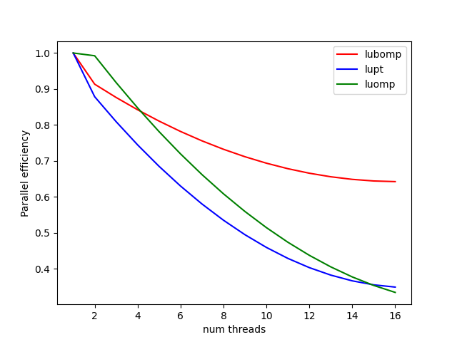

# Parallel LU Decomposition

The submission contains 3 files: 

1. [pthread_LU.cpp](pthread_LU.cpp): pthread implementation of LU decomposition. 
2. [openmp_LU.cpp](openmp_LU.cpp): openmp implementation of LU decomposition.  
3. [openmp_LU_block.cpp](openmp_LU_block.cpp): openmp implementation of block based LU decomposition.   


## Using the code

Build

```bash
make
````

Pthread

```bash
./lupt <size> <num_threads>
./lupt 4000 4
./lupt 8000 8
````

Openmp

```bash
./luomp 8000 16
````

Openmp LUD block impl.

```bash
./lubomp 8000 16
```

Check [Is not parallelized & optimized, running on large size can take long]  
Prints the L2 norm of `PA - LU`.
```bash
./lu[pt/omp/bomp] 1000 4 --check
```

## Implementation details:  

All the 3 implementations perform LU decomposition on `n x n` matrixes with pivoting.  
The C++'s `std::uniform_real_distribution<double>` & `std::default_random_engine` are used for the rng.  

For reference the pseudo-code for the serial impl. for is pasted below.  

```py
    inputs: a(n,n)
    outputs: π(n), l(n,n), and u(n,n)

    initialize π as a vector of length n
    initialize u as an n x n matrix with 0s below the diagonal
    initialize l as an n x n matrix with 1s on the diagonal and 0s above the diagonal
    for i = 1 to n
      π[i] = i

    for k = 1 to n    # Loop 1 : Outer loop
      max = 0
      for i = k to n
        if max < |a(i,k)|
          max = |a(i,k)|
          k' = i
      if max == 0
        error (singular matrix)
      swap π[k] and π[k']
      swap a(k,:) and a(k',:)
      swap l(k,1:k-1) and l(k',1:k-1)
      u(k,k) = a(k,k)
      for i = k+1 to n         # Loop 2        
        l(i,k) = a(i,k)/u(k,k)
        u(k,i) = a(k,i)
         
      for i = k+1 to n       # Loop 3 Bottleneck 
        for j = k+1 to n     # Loop 4 Bottleneck 
          a(i,j) = a(i,j) - l(i,k)*u(k,j)
```


### pthread 
Since each iteration of the outer loop depends on the result of the previous iteration, this loop can't be parallelized.   
 The bottlenecks inside the outer loop are the Loop 3 and Loop 4, since they perform `O(n^2)` operations.   Hence we parallelize the loop 3, by diving the `rows[k+1:n]` among threads.  The layout of the matrices is also dictated by this bottleneck. **A & U are layed out in row major form, L is layed out in col. major form.**    
 The rows assigned to each thread are sufficiently wide and sufficient apart to avoid false sharing.    
 One thing to note here is that if we allow loop 4 to iterate over the whole U's row then it will keep brining U's row in cache, but by the time of next iteration the top level caches will contain the last part of the row. The start of the row would have been swapped out.    
 Because of this, instead of calculating A(i,j) row by row we calculate it in tiles of size `TILE_SIZE x TILE_SIZE` to make the best use of what was brought into cache from L' col and U' row.  Since A(i, j) is read/written only once we don't need to worry about cache misses(any TILE size which is multiple of CACHE BLOCK size = 64 will do). From experiments, it was found that TILE_SIZE = 256 works the best.      

 Each iteration of the outer Loop (Loop 1) is barrier synchronized using `pthread_barrier_wait(barrier)`.   


### openmp
  The pthread implementation is repeated using openmp constructs.   
  On top of outer for loop 
  ```c++
  #pragma omp parallel num_threads(thread_count)
    for (int k = 0; k < n; k++)
    {
  ```
  is used to spawn the threads. Note that since `parallel for` is not used, this loop isn't parallelized.   
  Same as the pthread implementation, Loop 3 is parallelized using `pragma omp for` and the same tile based implementation is used.    
  This does not spawn new threads at each iteration, instead the same thread pool is used which was spawned at the start.   
  I also tried to use SIMD for loop 4: `a(i,j) = a(i,j) - l(i,k) * u(k,j)`
  ```c++
    double c = L(i, k);
    double *__restrict__ Arow = &A[i * n];
    double *__restrict__ Urow = &U[k * n];

#pragma omp simd uniform(Arow, Urow) linear(j : 1)
    for (int j = j_st; j < j_end; j++)
    {
        Arow[j] -= c * Urow[j];
    }
  ```
  but I didn't see any performance improvements as compared to `g++'s -O3`. My guess is that `-O3` was smart enough to vectorize this loop on its own.    

### openmp block based LU decomposition

Due to similar cache miss reasoning described in pthread implementation, it would be better to do the whole LU decomposition in tiles. This would lead to lesser cache misses, lesser barrier synchronization, more explicit parallelism & more chances of SIMD vectorziation. [Details below]

We divide A, L, U into tiles
```
A =    
    [A11 A12 A13 ... A1k  
     A21 A22 A23 ... A2k  
      .   .   .  ...  .   
     Ak1 Ak2 Ak3 ... Akk]   


Where each Aij is a matrix of size `TILE SIZE x TILE SIZE`.   


L =    
    [L11  0   0  ...  0    
     L21 L22  0  ...  0   
      .   .   .  ...  .   
     Lk1 Lk2 Lk3 ... Lkk]   


U =    
    [U11 U12 U13 ... U1k  
      0  U22 U23 ... U2k  
      .   .   .  ...  .   
      0   0   0  ... Ukk]   

```
Now we note that,   
`A11 = L11 * U11`   
`Li1 = Ai1 * inv(U11)`  
`U1i = inv(L11) * A1i`   

Which is same as our normal updates, if the size of tile is 1x1.   
Using this we can first calculate L11, U11 using LU decomp. of A11 and then calculate their inverses. After this we can calculate Li1 and U1i in parallel.    
After this we have to update the next submatrix: `A(i,j) = A(i,j) - L(i,k)*U(k,j)` like before. The only difference is here A(i,j), L(i,k) and U(k,j) are tiles.  Each A(i,j) is calculated in parallel and because of doing it in matrices(tiles) we get the benefit of cache locality. We also get benefit of auto SIMD vectorization in these matrix multiplications.  
Finally, instead of `n` there are `n / TILE_SIZE` barrier syncs.   

At each iteration, Pivoting is also done for the rows in A11 before calculating L11 and U11.   
Using experiments it was found that for 16 cores, `TILE_SIZE = 8` performs the best. This is a measure of how much data can be fit into cache.  


## Evaluation

The implementations were tested on gpu.hpc.iitd.ac.in login node, which is a 24 core machine. The runtime if noted for `8000 x 8000` size matrix with varying number of threads.   


As expected the block based implementation performs better even with single thread, due to lesser cache misses.   
```
+----------------+----------+----------+----------+
|   num. threads |   lubomp |     lupt |    luomp |
+================+==========+==========+==========+
|              1 | 124558   | 194921   | 198065   |
+----------------+----------+----------+----------+
|              2 |  68663.2 | 117608   |  95118.6 |
+----------------+----------+----------+----------+
|              3 |  49959.7 |  85230.6 |  72611.1 |
+----------------+----------+----------+----------+
|              4 |  37970.3 |  61641.1 |  55920.4 |
+----------------+----------+----------+----------+
|              5 |  31356   |  54029.2 |  47341.1 |
+----------------+----------+----------+----------+
|              6 |  24860.7 |  62372.4 |  47140.3 |
+----------------+----------+----------+----------+
|              7 |  24020.5 |  44991.1 |  41673.4 |
+----------------+----------+----------+----------+
|              8 |  21593.4 |  40466.6 |  42612.3 |
+----------------+----------+----------+----------+
|              9 |  19791.4 |  42004   |  39958.3 |
+----------------+----------+----------+----------+
|             10 |  18072.5 |  39726   |  41636.4 |
+----------------+----------+----------+----------+
|             11 |  16951.6 |  59320.4 |  38466.1 |
+----------------+----------+----------+----------+
|             12 |  13997.2 |  38234.7 |  38127.2 |
+----------------+----------+----------+----------+
|             13 |  14821   |  36872.2 |  37058   |
+----------------+----------+----------+----------+
|             14 |  13982   |  37857.3 |  37177.2 |
+----------------+----------+----------+----------+
|             15 |  12399.1 |  35807.3 |  36440.5 |
+----------------+----------+----------+----------+
|             16 |  12833.8 |  35440.1 |  36130.7 |
+----------------+----------+----------+----------+
```

The parallel efficiency(after smoothening the curve) is plotted below 



As the threads increase, all the 3 curves are saturating, due to some amount of serial work that can't be parallelized.   
As expected the block based implementation is more efficient.   


